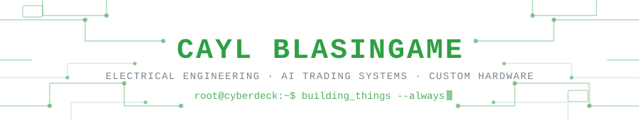

<p align="center">
  
</p>

```text
$ whoami
Cayl Blasingame — EE student, Texas State University

$ status --now
Building a Raspberry Pi 5 cyberdeck (custom CAD enclosure, 18650 array)
Shipping the PWA → Capacitor iOS pipeline
Open to Summer 2027 EE / quant-dev / full-stack internships
```

### About

I'm an Electrical Engineering student at Texas State University working the seam between hardware and software — one day that's an AI agent trading options or pricing betting markets, the next it's CAD-modeling the enclosure for a Raspberry Pi cyberdeck. Before any of that, I was an Eagle Scout, then founded *The Junto Press* because I didn't want to wait for a journalism degree to publish real reporting.

### Technical Stack

<p align="left">
  
  
  
  
  
  
  
  
  
  
  
</p>

### Featured Projects

<table>
  <tr>
    <td width="50%" align="center">
      <a href="https://github.com/CBlasingameLLC/thejuntopress">
        
      </a>
      <br/>
      <a href="https://juntopress.live">🌐 juntopress.live</a>
    </td>
    <td width="50%" align="center">
      <a href="https://github.com/CBlasingameLLC/JPII_Website">
        
      </a>
      <br/>
      <a href="https://jpii-website-pi.vercel.app">🌐 Live Site</a>
    </td>
  </tr>
  <tr>
    <td width="50%" align="center">
      <a href="https://github.com/CBlasingameLLC/blackjack-app">
        
      </a>
      <br/>
      <a href="https://blackjack-app-5k78.vercel.app">🌐 Try It Live</a>
    </td>
    <td width="50%" align="center">
      <a href="https://github.com/CBlasingameLLC/poker-trainer">
        
      </a>
      <br/>
      <a href="https://poker-trainer-lemon-nine.vercel.app">🌐 Try It Live</a>
    </td>
  </tr>
</table>

### Currently Building: Modular Cyberdeck

A Raspberry Pi 5 cyberdeck, from the CAD up:

- **Board:** Raspberry Pi 5
- **Enclosure:** Custom-designed in CAD, not off-the-shelf
- **Power:** 18650 Li-ion battery array
- **Status:** In active development — repo and build log coming once it's past breadboard stage

No repo yet, but it's the reason "Autodesk" is in the stack above.

### Connect

<p align="left">
  <a href="https://linkedin.com/in/cayl-blasingame" target="_blank" rel="noopener noreferrer"></a>
  <a href="https://x.com/CaylBlasingame" target="_blank" rel="noopener noreferrer"></a>
  <a href="https://instagram.com/cayl_blasingame" target="_blank" rel="noopener noreferrer"></a>
</p>

### GitHub Statistics

<p align="center">
  
  
</p>

### Contribution Graph

<p align="center">
  
</p>
